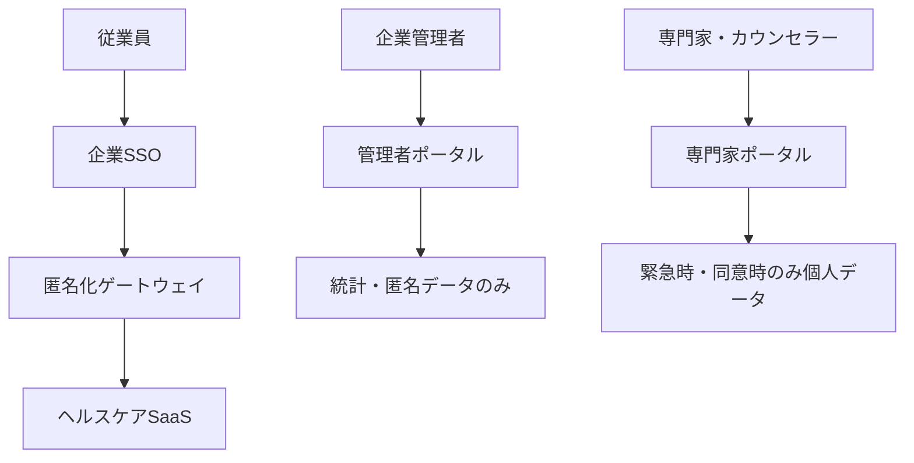
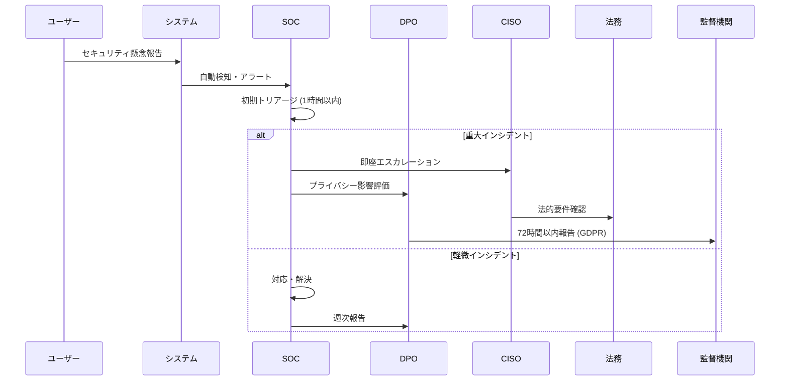

# 企業向けメンタルヘルスSaaS 認証・プライバシー保護システム設計

## 概要

企業従業員のメンタルヘルス情報を、**企業管理者・経営陣からも完全に匿名化**しつつ、適切なケア体制をバックアップするための認証・プライバシー保護システムの設計書です。

---

## 1. 基本設計思想

### 1.1 プライバシー保護の原則

```
🔐 ゼロノレッジ原則
├─ 企業側は個人の特定できるメンタルヘルス情報にアクセス不可
├─ システム管理者も個人データと企業データを関連付け不可
├─ 統計・傾向情報のみ企業側に提供
└─ 緊急時のみ専門家が介入可能

🎯 目的達成のバランス
├─ 個人プライバシーの完全保護
├─ 企業の組織健康管理責任の履行
├─ 法的要件（労働安全衛生法等）の遵守
└─ メンタル不調者への適切なケア提供
```

### 1.2 技術的実現方針

```
🔑 多層暗号化・匿名化
├─ クライアント側暗号化（E2E）
├─ 仮名化・匿名ID生成
├─ データベース暗号化
└─ アクセス制御・監査ログ

🏢 企業統合・利便性
├─ 既存SSO（Single Sign-On）との統合
├─ シームレスなユーザー体験
├─ 企業セキュリティポリシー準拠
└─ 管理負荷の最小化
```

---

## 2. 認証アーキテクチャ設計

### 2.1 三層認証システム



#### Layer 1: 企業SSO認証
```
🏢 企業認証層
├─ 目的: 企業従業員の身元確認・アクセス権限管理
├─ 技術: SAML 2.0 / OAuth 2.0 / OpenID Connect
├─ 情報: employeeId, department, role, email
└─ 保持期間: 企業ポリシーに従う
```

#### Layer 2: 匿名化ゲートウェイ
```
🎭 匿名化層
├─ 目的: 企業識別情報とヘルスケア情報の分離
├─ 技術: 暗号学的ハッシュ + Salt + 時間ベース回転
├─ 生成: anonymousHealthId (AES-256暗号化)
└─ 特徴: 企業側からは逆算不可能、個人は一意特定
```

#### Layer 3: ヘルスケアSaaS認証
```
🏥 ヘルスケア層
├─ 目的: メンタルヘルス情報の安全な管理・提供
├─ 技術: JWT + 短期間トークン + リフレッシュ機構
├─ 情報: anonymousHealthId のみ（個人特定情報なし）
└─ 暗号化: クライアント側E2E暗号化
```

### 2.2 匿名固有識別システム

#### 2.2.1 Anonymous Health ID 生成方式

```typescript
// 匿名化ID生成アルゴリズム
function generateAnonymousHealthId(
  employeeId: string,
  companyId: string,
  timestamp: number,
  serverSalt: string
): string {
  // 1. 企業固有Salt生成（回転式）
  const companySalt = generateCompanySalt(companyId, timestamp);
  
  // 2. 個人識別子のハッシュ化
  const personalHash = sha3_512(employeeId + companySalt + serverSalt);
  
  // 3. AES-256暗号化
  const encryptedId = aes256Encrypt(personalHash, getEncryptionKey());
  
  // 4. Base64URLエンコード
  return base64URLEncode(encryptedId);
}

// 特徴:
// - 企業側からは逆算不可能
// - 同一従業員は常に同一ID
// - 時間ベースSalt回転で追跡困難
// - 専門家同意時のみデクリプト可能
```

#### 2.2.2 プライバシー保護レベル

| 情報種別 | 企業管理者 | システム管理者 | 専門家 | 本人 |
|---------|------------|----------------|--------|------|
| 個人識別情報 | ❌ | ❌ | ⚠️※1 | ✅ |
| メンタルヘルス詳細 | ❌ | ❌ | ⚠️※1 | ✅ |
| 統計・傾向データ | ✅ | ✅ | ✅ | ✅ |
| 緊急アラート | ⚠️※2 | ❌ | ✅ | ✅ |

```
※1 専門家アクセス: 本人同意 + 緊急性判定 + 監査ログ
※2 企業アラート: 匿名化された緊急度情報のみ
```

---

## 3. データ暗号化・保護システム

### 3.1 エンドツーエンド暗号化

#### 3.1.1 暗号化フロー

```typescript
// クライアント側暗号化（ブラウザ）
class HealthDataEncryption {
  private userKey: CryptoKey;
  private sessionKey: CryptoKey;
  
  async encryptHealthData(data: HealthData): Promise<EncryptedData> {
    // 1. セッション固有キー生成
    this.sessionKey = await crypto.subtle.generateKey(
      { name: "AES-GCM", length: 256 },
      false,
      ["encrypt", "decrypt"]
    );
    
    // 2. メンタルヘルスデータ暗号化
    const encryptedData = await crypto.subtle.encrypt(
      { name: "AES-GCM", iv: crypto.getRandomValues(new Uint8Array(12)) },
      this.sessionKey,
      new TextEncoder().encode(JSON.stringify(data))
    );
    
    // 3. セッションキーをユーザーキーで暗号化
    const encryptedSessionKey = await crypto.subtle.encrypt(
      { name: "RSA-OAEP" },
      this.userKey,
      await crypto.subtle.exportKey("raw", this.sessionKey)
    );
    
    return {
      encryptedData: arrayBufferToBase64(encryptedData),
      encryptedKey: arrayBufferToBase64(encryptedSessionKey),
      timestamp: Date.now(),
      anonymousHealthId: this.anonymousHealthId
    };
  }
}
```

#### 3.1.2 キー管理システム

```
🔐 階層的キー管理
├─ Master Key (HSM保管)
│  ├─ 企業別Master Key派生
│  └─ 定期回転（年1回）
├─ User Encryption Key (クライアント生成)
│  ├─ ブラウザローカル保存
│  └─ デバイス固有・生体認証保護
├─ Session Key (一時的)
│  ├─ セッション毎生成
│  └─ メモリ内のみ保持
└─ Database Encryption Key (AES-256)
   ├─ 保存時暗号化
   └─ 定期回転（月1回）
```

### 3.2 データベース設計

#### 3.2.1 分離データベース設計

```sql
-- 企業管理データベース（企業側アクセス可能）
CREATE TABLE companies (
  company_id UUID PRIMARY KEY,
  company_name VARCHAR(255),
  subscription_plan VARCHAR(50),
  admin_contacts JSONB
);

CREATE TABLE anonymous_statistics (
  company_id UUID,
  date DATE,
  total_users INTEGER,
  engagement_rate DECIMAL(5,2),
  stress_level_distribution JSONB, -- 匿名化済み
  early_warning_count INTEGER,     -- 個人特定不可
  INDEX(company_id, date)
);

-- ヘルスケアデータベース（完全分離・暗号化）
CREATE TABLE encrypted_health_data (
  anonymous_health_id VARCHAR(255) PRIMARY KEY,
  encrypted_data LONGBLOB,              -- E2E暗号化済み
  encrypted_session_key BLOB,           -- ユーザーキーで暗号化
  data_hash VARCHAR(64),                -- 完全性検証
  created_at TIMESTAMP,
  updated_at TIMESTAMP,
  -- 企業識別情報は一切保存しない
  INDEX(anonymous_health_id, created_at)
);

-- 緊急対応データベース（専門家のみアクセス）
CREATE TABLE emergency_interventions (
  intervention_id UUID PRIMARY KEY,
  anonymous_health_id VARCHAR(255),
  risk_level ENUM('low', 'medium', 'high', 'critical'),
  intervention_type VARCHAR(100),
  counselor_id UUID,
  consent_obtained BOOLEAN,
  created_at TIMESTAMP,
  -- 本人同意または法的要件満たす場合のみ作成
  INDEX(anonymous_health_id, risk_level, created_at)
);
```

---

## 4. 企業統合・SSO設計

### 4.1 企業SSO統合パターン

#### 4.1.1 SAML 2.0統合

```xml
<!-- 企業側 IdP設定例 -->
<saml:AttributeStatement>
  <saml:Attribute Name="employeeId">
    <saml:AttributeValue>EMP001234</saml:AttributeValue>
  </saml:Attribute>
  <saml:Attribute Name="department">
    <saml:AttributeValue>Engineering</saml:AttributeValue>
  </saml:Attribute>
  <saml:Attribute Name="email">
    <saml:AttributeValue>user@company.com</saml:AttributeValue>
  </saml:Attribute>
  <!-- メンタルヘルス情報は含めない -->
</saml:AttributeStatement>
```

#### 4.1.2 OAuth 2.0 / OpenID Connect統合

```typescript
// OpenID Connect統合実装
class EnterpriseSSO {
  async authenticateEmployee(authCode: string): Promise<AuthResult> {
    // 1. 企業IdPでトークン交換
    const tokens = await this.exchangeCodeForTokens(authCode);
    
    // 2. ユーザー情報取得（企業側）
    const userInfo = await this.getUserInfo(tokens.access_token);
    
    // 3. 匿名ヘルスIDへ変換
    const anonymousHealthId = await this.generateAnonymousHealthId(
      userInfo.employeeId,
      userInfo.companyId
    );
    
    // 4. ヘルスケア専用JWTトークン発行
    const healthToken = await this.issueHealthToken({
      anonymousHealthId,
      // 個人特定情報は含めない
      permissions: this.calculateHealthPermissions(userInfo.role),
      expiresIn: '1h'
    });
    
    return {
      healthToken,
      anonymousHealthId,
      // 企業情報は統計目的のみ
      companyContext: {
        companyId: userInfo.companyId,
        department: userInfo.department
      }
    };
  }
}
```

### 4.2 セキュリティ要件

#### 4.2.1 企業セキュリティポリシー準拠

```yaml
security_requirements:
  authentication:
    mfa_required: true
    session_timeout: 30_minutes
    concurrent_sessions: 1
    
  network_security:
    tls_version: "1.3"
    certificate_pinning: true
    ip_whitelist_support: true
    
  data_protection:
    encryption_at_rest: "AES-256"
    encryption_in_transit: "TLS 1.3"
    key_rotation: "monthly"
    
  compliance:
    audit_logging: "all_access"
    data_retention: "company_policy"
    gdpr_compliance: true
    hipaa_consideration: true
```

---

## 5. 緊急対応・ケアシステム

### 5.1 緊急時介入プロトコル

#### 5.1.1 自動リスク検知

```typescript
// AI自動リスク検知システム
class MentalHealthRiskDetection {
  async analyzeRiskLevel(encryptedData: EncryptedHealthData): Promise<RiskAssessment> {
    // 1. クライアント側で復号化・分析
    const decryptedData = await this.clientSideDecrypt(encryptedData);
    
    // 2. リスクレベル判定（AIモデル）
    const riskLevel = await this.aiRiskAssessment(decryptedData);
    
    // 3. 緊急時のみサーバー通知
    if (riskLevel >= RiskLevel.HIGH) {
      return this.triggerEmergencyProtocol({
        anonymousHealthId: encryptedData.anonymousHealthId,
        riskLevel,
        timestamp: Date.now(),
        // 詳細データは含めない
        alertType: this.categorizeAlert(riskLevel)
      });
    }
    
    return { riskLevel, requiresIntervention: false };
  }
  
  private async triggerEmergencyProtocol(alert: EmergencyAlert): Promise<void> {
    // 1. 専門家への即座通知
    await this.notifyCounselors(alert);
    
    // 2. 企業への匿名アラート（個人特定不可）
    await this.notifyCompanyAnonymously({
      companyId: await this.getCompanyFromAnonymousId(alert.anonymousHealthId),
      alertLevel: alert.riskLevel,
      department: 'anonymized', // 部署も匿名化
      timestamp: alert.timestamp
    });
    
    // 3. 監査ログ記録
    await this.auditLog('emergency_protocol_triggered', alert);
  }
}
```

#### 5.1.2 専門家介入システム

```typescript
// 専門家（カウンセラー）向けシステム
class CounselorInterface {
  async requestDataAccess(
    anonymousHealthId: string,
    justification: string
  ): Promise<DataAccessResult> {
    // 1. 本人への同意要請
    const consentRequest = await this.requestUserConsent({
      anonymousHealthId,
      counselorId: this.counselorId,
      accessReason: justification,
      dataScope: 'mental_health_details',
      expiresIn: '24h'
    });
    
    // 2. 同意取得後のデータアクセス
    if (consentRequest.granted) {
      return this.getDecryptedHealthData({
        anonymousHealthId,
        consentToken: consentRequest.token,
        auditTrail: true
      });
    }
    
    return { access: 'denied', reason: 'user_consent_required' };
  }
  
  async provideCounseling(
    sessionData: CounselingSession
  ): Promise<CounselingResult> {
    // セッション記録も暗号化・匿名化
    const encryptedSession = await this.encryptCounselingNotes({
      anonymousHealthId: sessionData.anonymousHealthId,
      notes: sessionData.notes,
      recommendations: sessionData.recommendations,
      followUpRequired: sessionData.followUpRequired
    });
    
    // 企業への概要報告（個人特定不可）
    await this.reportToCompany({
      companyId: sessionData.companyContext.companyId,
      interventionType: sessionData.type,
      outcome: sessionData.outcome,
      followUpScheduled: sessionData.followUpRequired
    });
    
    return { status: 'completed', nextSteps: sessionData.recommendations };
  }
}
```

### 5.2 企業向けダッシュボード（匿名化）

#### 5.2.1 統計・傾向情報のみ提供

```typescript
// 企業管理者向けダッシュボード
interface CompanyDashboard {
  // ✅ 提供可能な情報
  overallEngagement: {
    dailyActiveUsers: number;
    weeklyActiveUsers: number;
    averageSessionDuration: number;
  };
  
  aggregatedWellbeing: {
    stressLevelDistribution: {
      low: number;    // 人数・割合のみ
      medium: number;
      high: number;
    };
    engagementTrends: TimeSeriesData[];
    departmentComparisons: DepartmentStats[];
  };
  
  earlyWarningSystem: {
    anonymousAlertsCount: number;
    interventionsProvided: number;
    // 個人特定は一切不可
  };
  
  // ❌ 提供不可能な情報
  // individualEmployeeData: never;
  // personalHealthDetails: never;
  // identifiableMetrics: never;
}
```

---

## 6. 法的・コンプライアンス要件

### 6.1 労働安全衛生法対応

#### 6.1.1 企業の安全配慮義務履行

```
📋 法的要件への対応
├─ 労働安全衛生法第66条の10（心理的負荷の程度の把握）
│  ├─ 対応: 匿名化統計での組織健康状態把握
│  ├─ 方法: 部署別・職種別の傾向分析提供
│  └─ 制限: 個人特定できる情報は一切提供しない
│
├─ 労働契約法第5条（安全配慮義務）
│  ├─ 対応: 早期警告システムによる迅速介入
│  ├─ 方法: AIリスク検知 + 専門家自動アサイン
│  └─ 制限: 本人同意なしでは詳細アクセス不可
│
└─ 個人情報保護法（要配慮個人情報）
   ├─ 対応: 匿名化・暗号化による完全保護
   ├─ 方法: ゼロナレッジアーキテクチャ
   └─ 制限: 本人以外は復号不可能
```

#### 6.1.2 GDPR・プライバシー法準拠

```yaml
gdpr_compliance:
  lawful_basis:
    - legitimate_interest: "workplace_safety"
    - consent: "explicit_opt_in"
    - vital_interest: "emergency_intervention"
  
  data_subject_rights:
    access: "encrypted_personal_dashboard"
    rectification: "user_self_service"
    erasure: "complete_data_deletion"
    portability: "encrypted_export"
    object: "instant_processing_stop"
  
  privacy_by_design:
    data_minimization: true
    purpose_limitation: true
    storage_limitation: true
    accountability: "audit_trail"
```

---

## 7. 実装ロードマップ

### 7.1 Phase 1: 基盤構築（MVP期間）

#### 7.1.1 認証基盤 (4週間)

```
Week 1-2: 企業SSO統合
✅ 実装項目:
- [ ] SAML 2.0 / OAuth 2.0統合
- [ ] 匿名化ゲートウェイ開発
- [ ] Anonymous Health ID生成システム
- [ ] 基本セキュリティ設定

Week 3-4: 暗号化システム
✅ 実装項目:
- [ ] E2Eクライアント暗号化
- [ ] キー管理システム
- [ ] データベース分離設計
- [ ] 基本監査ログ
```

#### 7.1.2 プライバシー保護 (2週間)

```
Week 5-6: データ保護機能
✅ 実装項目:
- [ ] 暗号化データストレージ
- [ ] アクセス制御システム
- [ ] 基本統計・匿名化機能
- [ ] GDPR対応機能（基本）
```

### 7.2 Phase 2: 緊急対応システム（β版期間）

#### 7.2.1 リスク検知・介入 (6週間)

```
Week 1-3: AI緊急検知
✅ 実装項目:
- [ ] クライアント側AIリスク分析
- [ ] 緊急時アラートシステム
- [ ] 専門家通知システム
- [ ] 企業匿名アラート

Week 4-6: 専門家システム
✅ 実装項目:
- [ ] カウンセラー専用ポータル
- [ ] 同意管理システム
- [ ] セッション記録暗号化
- [ ] 介入効果測定
```

### 7.3 Phase 3: 高度機能（正式版期間）

#### 7.3.1 エンタープライズ機能 (12週間)

```
Week 1-4: 企業管理機能
✅ 実装項目:
- [ ] 高度統計ダッシュボード
- [ ] 部署別傾向分析
- [ ] 予測アナリティクス
- [ ] カスタムレポート

Week 5-8: セキュリティ強化
✅ 実装項目:
- [ ] SOC2 Type2対応
- [ ] 高度監査機能
- [ ] セキュリティ認証取得
- [ ] ペネトレーションテスト

Week 9-12: 最適化・拡張
✅ 実装項目:
- [ ] 多地域対応
- [ ] 高可用性システム
- [ ] パフォーマンス最適化
- [ ] API・統合機能
```

---

## 8. 技術スペック・要件

### 8.1 セキュリティ技術要件

```yaml
encryption:
  client_side: "AES-256-GCM"
  transport: "TLS 1.3"
  storage: "AES-256-CBC"
  key_management: "FIPS 140-2 Level 3 HSM"

authentication:
  enterprise_sso: ["SAML 2.0", "OAuth 2.0", "OpenID Connect"]
  mfa: "TOTP + WebAuthn"
  session: "JWT + Refresh Token"
  anonymization: "SHA3-512 + AES-256"

infrastructure:
  hosting: "SOC2 Type2 Certified Cloud"
  backup: "Encrypted + Multi-Region"
  monitoring: "24/7 Security Operations Center"
  incident_response: "< 1 hour"
```

### 8.2 プライバシー技術要件

```yaml
data_protection:
  anonymization: "cryptographic_pseudonymization"
  segregation: "separate_databases"
  access_control: "role_based + attribute_based"
  audit_trail: "immutable_blockchain_log"

privacy_features:
  consent_management: "granular_opt_in_out"
  data_portability: "encrypted_export"
  right_to_erasure: "complete_deletion"
  data_minimization: "purpose_bound_collection"
```

---

## 9. 運用・管理体制

### 9.1 セキュリティ管理体制

```
🔐 セキュリティ組織
├─ CISO (Chief Information Security Officer)
│  ├─ 責任: 全体セキュリティ戦略・事故対応
│  └─ 権限: セキュリティポリシー策定・変更
│
├─ DPO (Data Protection Officer)
│  ├─ 責任: プライバシー保護・GDPR準拠
│  └─ 権限: データ処理監視・監査実施
│
├─ セキュリティエンジニア
│  ├─ 責任: 技術的セキュリティ対策・監視
│  └─ 権限: システム設定・インシデント初動
│
└─ 内部監査チーム
   ├─ 責任: 定期セキュリティ監査・改善提案
   └─ 権限: 全システムアクセス・監査レポート作成
```

### 9.2 インシデント対応プロセス



---

## 10. 成功指標・KPI

### 10.1 セキュリティ・プライバシーKPI

```yaml
security_metrics:
  incident_prevention:
    target: "0 security breaches"
    measurement: "monthly_audit"
  
  privacy_compliance:
    target: "100% GDPR compliance"
    measurement: "quarterly_assessment"
  
  access_control:
    target: "0 unauthorized_access"
    measurement: "continuous_monitoring"

privacy_metrics:
  anonymization_effectiveness:
    target: "0% re-identification_risk"
    measurement: "privacy_engineering_analysis"
  
  user_consent:
    target: "95% informed_consent_rate"
    measurement: "consent_flow_analytics"
  
  data_minimization:
    target: "only_necessary_data_collected"
    measurement: "data_flow_audit"
```

### 10.2 ビジネス・運用KPI

```yaml
business_metrics:
  enterprise_adoption:
    target: "90% employee_participation"
    measurement: "monthly_active_users"
  
  care_effectiveness:
    target: "80% early_intervention_success"
    measurement: "outcome_tracking"
  
  compliance_efficiency:
    target: "50% reduction_in_compliance_burden"
    measurement: "admin_time_tracking"
```

---

**文書管理:**
- 作成日: 2025-06-18
- 更新頻度: 月次
- 責任者: CISO + DPO
- 承認者: [要確認]
- 版数: v1.0